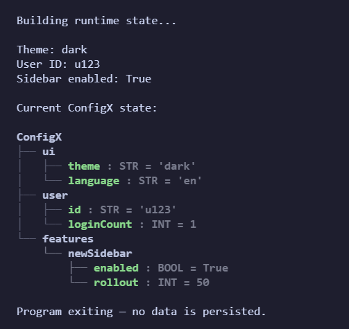
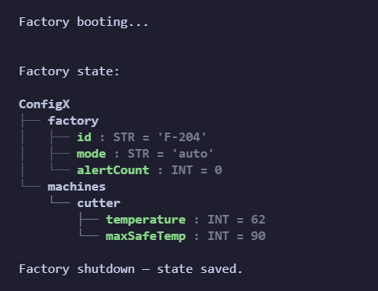
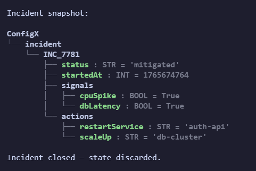

# ConfigX Examples

This directory contains practical examples showing how ConfigX is used
in real systems.

They show ConfigX as:
- a runtime state graph
- a decision memory
- a system brain
- an AI memory substrate

Some examples persist state.
Others intentionally do not.

This flexibility is the point.

## Key Idea

ConfigX is not just a config-file tool.
It is a **living parameter graph** that can be built dynamically,
queried consistently, and optionally persisted.

---

## Example Outputs

### Example 01: Runtime-only Usage
Used as an in-memory parameter engine. Nothing is written to disk; all state disappears when the process exits.

### Example 02: Persistent Application State
A smart factory simulation that adjusts its behavior based on sensor readings. State persists across runs using a Write-Ahead Log (WAL) and snapshots.

### Example 03: Persistent AI Agent Memory
ConfigX acts as a long-term memory store for an autonomous AI agent ("Atlas"). There is no fixed schema; memory grows organically.

### Example 04: Runtime Incident Response
Used to track a live system failure event. This demonstrates situational awareness where persistence is not required.

